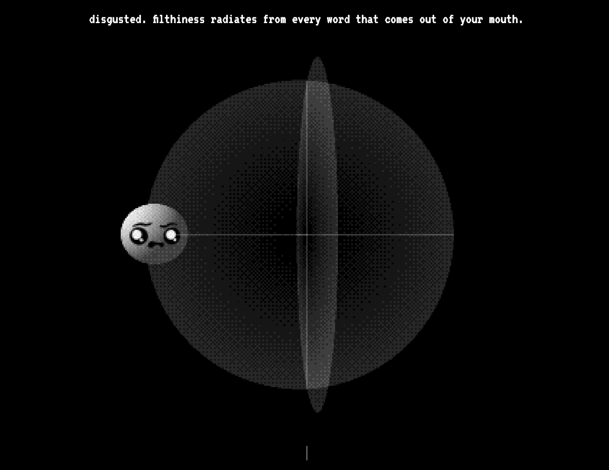

# Gizmo & the Emotion Vectors

This is an experiment that explores controlling a character's emotions. It uses the same weights to influence both the language model's output through control vectors and the visual blend of facial expressions with linear interpolation.



## How It Works

This project utilizes the [repeng](https://github.com/vgel/repeng) library to implement control vectors for emotion manipulation in language models. The control vectors allow for fine-tuned adjustments to the model's output, influencing the emotional tone of the generated text.

The system uses the same emotion weights to control both the language model's output and the visual representation. For the visuals, it employs linear interpolation between several SVG images, each representing an extreme of an emotional axis (e.g., happy-sad, angry-calm). This technique allows for smooth blending of facial expressions, creating a wide range of nuanced emotional states that correspond directly to the language model's output.

## Limitations

- The system lacks a sophisticated cognitive architecture like the [Soul Engine](https://opensouls.org/), which limits the character's ability to exhibit more complex reasoning, interesting personality traits, or deeper emotional intelligence. On top of this, the backend runs on top of an outdated language model. As a consequence, Gizmo may be easily confused, answer in an unsophisticated way, or provide nonsensical answers depending on the input.

- Gizmo will be especially confused if you set an emotional state that doesn't match the conversation. For example, if you make Gizmo happy and then talk about an upsetting topic.

- The voice synthesis (ElevenLabs) is separate from the emotion control system. It generates speech based on the text output, adding its own emotional intonation.

## Running

To run this project, you'll need to set up the backend and frontend separately.

### Set up the backend

1. Navigate to the `backend` folder:

   ```
   cd backend
   ```

2. Create a Python virtual environment:

   ```
   python -m venv venv
   ```

3. Activate the virtual environment:

   - On Windows:
     ```
     venv\Scripts\activate
     ```
   - On macOS and Linux:
     ```
     source venv/bin/activate
     ```

4. Install the required Python packages:

   ```
   pip install -r requirements.txt
   ```

5. Start the backend server:
   ```
   python main.py
   ```

### Set up the frontend

1. Navigate to the `web` folder:

   ```
   cd web
   ```

2. Install the required npm packages:

   ```
   npm install
   ```

3. Start the development server:

   ```
   npm run dev
   ```

4. Open your browser and go to the URL provided by the development server (usually http://localhost:5173).

Make sure both the backend and frontend are running simultaneously for the application to work properly.
